[Descarga Ren'Py](https://www.renpy.org/latest.html)
## Crear un proyecto en Ren'Py

Al abrir el _Launcher_ de Ren'Py podrás **cambiar el idioma a español**, crear un proyecto nuevo y elegir su nombre y resolución.

Lo más importante es que la resolución del proyecto coincida con la de las imágenes que utilizarás. De esta forma evitarás tener que escalarlas constantemente y conservarás una mejor calidad visual.

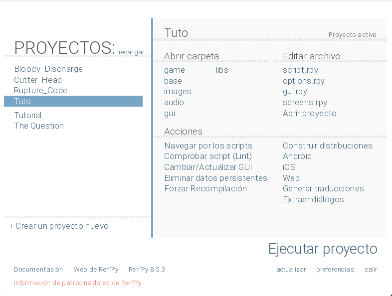

---
 
#### Configurar las preferencias

En **Preferencias** puedes elegir la carpeta donde se guardarán todos tus proyectos.

Te recomiendo mantener una estructura de carpetas ordenada desde el principio. Aunque al inicio parezca un detalle sin importancia, con el tiempo agradecerás saber exactamente dónde está cada proyecto.

Además, te recomiendo instalar **Visual Studio Code** y configurarlo como editor de texto del sistema. Así Ren'Py lo utilizará automáticamente para abrir los archivos `.rpy` y no tendrás que volver a configurarlo después de cada actualización.

[Visual Studio Code - Descargar](https://code.visualstudio.com/download?_exp_download=fb315fc982)

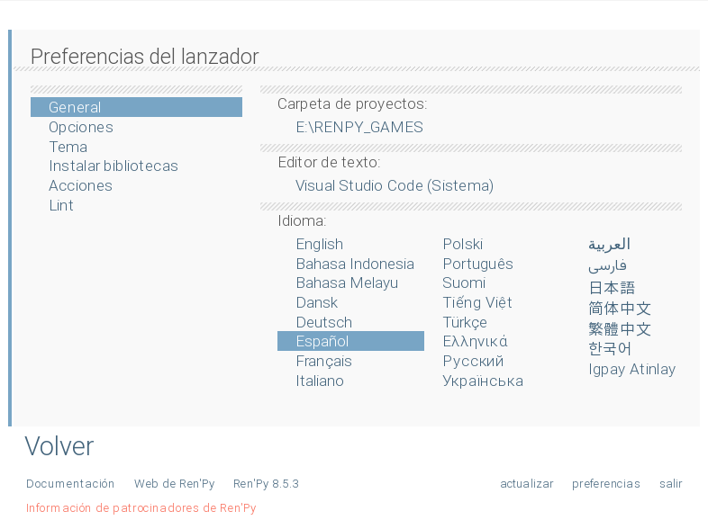

---
#### Conociendo la estructura del proyecto

Una vez creado el proyecto (en este ejemplo llamado **NuevoProyecto**), observarás que en la sección **Editar archivo** aparecen varios archivos con la extensión `.rpy`. Estos contienen el código de tu novela visual.

Por ahora no nos centraremos en ellos. Lo importante es la sección **Abrir carpeta**, donde encontrarás la estructura del proyecto y las carpetas en las que agregarás los recursos que utilizará tu juego.

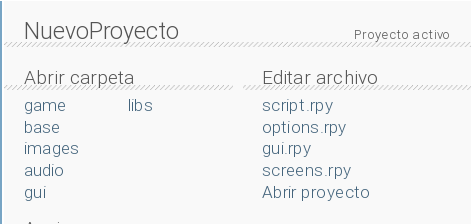

---
#### Organizando los recursos

Antes de comenzar a programar la historia, lo habitual es importar todos los recursos del proyecto. Desde el principio intenta mantener una estructura organizada.

También te recomiendo aprender a utilizar **Git** y **GitHub**. No les tengas miedo: son herramientas indispensables para cualquier desarrollador y te ayudarán a mantener un historial de cambios, realizar copias de seguridad y colaborar con otras personas.

En la carpeta `images`, por ejemplo, puedes separar los recursos de la siguiente manera:

- `backgrounds` para los fondos.
    
- `cgs` para las ilustraciones especiales.
    

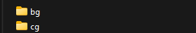

**Para los sprites de tu novela visual, te recomiendo que crees una carpeta de personaje que contenga los sprites. Por ejemplo: Carpeta -> "Yuri", y dentro de ella agregar los sprites.**

---

Con la carpeta `audio` ocurre lo mismo. Lo recomendable es separar la música de los efectos de sonido en carpetas independientes.

Por ejemplo:

- `music`
    
- `sfx`
    

Esta pequeña organización hará que encontrar un recurso específico sea mucho más rápido a medida que tu proyecto aumente de tamaño.

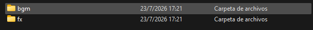

---
## Programar en Ren'Py

**A partir de aquí aprenderás todo lo necesario para empezar a programar tu novela visual. Es sencillo, ¡no te desanimes!**


A continuación abriremos el archivo **`script.rpy`**.

Por ahora **nos centraremos únicamente en este archivo**, ya que contiene todo lo necesario para comenzar a desarrollar una novela visual desde cero. Más adelante profundizaremos en cada una de las opciones y en las características más avanzadas de Ren'Py.

Al abrir **`script.rpy`**, encontrarás un contenido similar al siguiente:

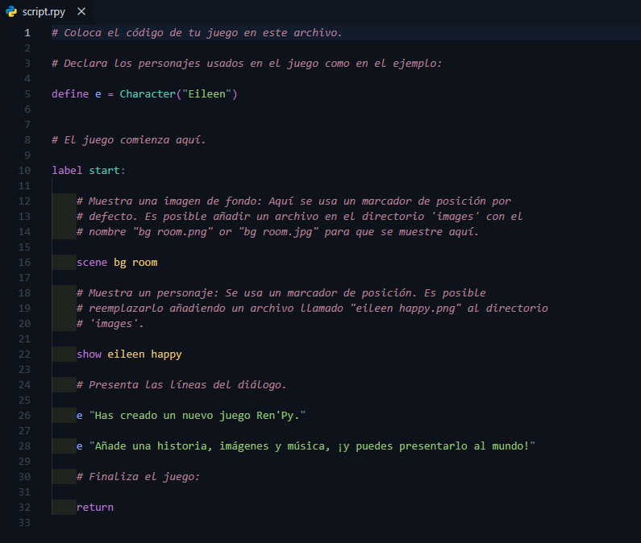

---
### Líneas de diálogo

#### El narrador

Cuando escribes un texto entre comillas **sin poner un personaje antes**, Ren’Py entiende que el narrador está hablando.

```python
label start:

    "La habitación estaba completamente vacía."

    "El viento golpeaba las ventanas."

    return
```

---
#### Un personaje

Primero debes crear el personaje.

```python
define y = Character("Yuri")
```

Después puedes usar la variable `y` para hacer que hable.

```python
label start:

    y "Hola."

    y "Me alegra verte."

    return
```

---
### Definir personajes

Como puedes observar en **`script.rpy`**, estamos utilizando la función **`Character()`**, la cual se asigna a la variable **`e`**, correspondiente a **Eileen**. Esta función recibe como parámetro una **cadena de texto** (`string`) con el valor **`"Eileen"`**, que será el nombre que aparecerá en la caja de diálogo del juego cada vez que el personaje hable.

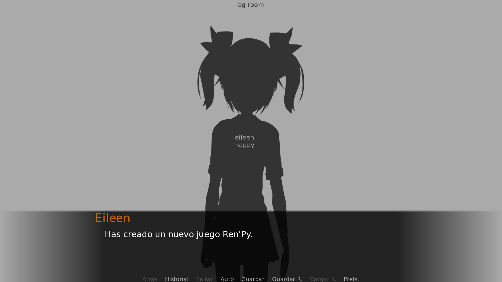


```python
define e = Character("Eileen")
```

Puedes ponerle **el nombre que quieras** a una variable, aunque lo recomendable es que sea corto o una abreviatura, ya que esa variable solo la utilizarás **tú** como programador o programadora.

Como dato curioso, la función **`Character()`** te ahorra muchísimo tiempo, ya que evita que tengas que escribir el nombre del personaje cada vez que habla.

Por ejemplo, usando `Character()` escribirías:

```python
define y = Character("Yuri")

label start:

    y "Hola."
    y "¿Cómo estás?"
    y "Espero que tengas un buen día."
```

Observa que únicamente escribimos **`y`**, y Ren'Py ya sabe que el nombre que debe mostrar en pantalla es **Yuri**.

Sin embargo, también es completamente válido escribir los diálogos sin definir un personaje:

```python
label start:

    "Yuri" "Hola."
    "Yuri" "¿Cómo estás?"
    "Yuri" "Estresado porque tengo que escribir todo el nombre de este pj."
```

Como puedes notar, el nombre **"Yuri"** debe escribirse en cada línea de diálogo. No es un problema cuando el personaje habla una o dos veces, pero si aparece durante toda la historia terminarás escribiendo su nombre cientos de veces.

Por eso, para los personajes principales siempre es recomendable utilizar **`Character()`**.

Si un personaje solo aparecerá una vez o tendrá muy pocas líneas de diálogo, no pasa absolutamente nada por escribir su nombre directamente.

Por ejemplo:

```python
label start:

    "Doctor" "Los resultados ya están listos."
```

En este caso crear un personaje con `Character()` sería innecesario.

En cambio, si ese doctor aparecerá varias veces a lo largo de la historia, entonces sí conviene definirlo:

```python
define d = Character("Doctor")
```

---

**Resumen**

```python
define e = Character("Eileen")
```

- `e` es el **nombre interno** que tú escribirás en el código.
- `"Eileen"` es el **nombre que verá el jugador** en la caja de diálogo.

Cuando escribes:

```python
e "Hola."
```

Ren'Py muestra:

**Eileen:** Hola.

---
### Definiendo imágenes

Ren'Py permite estas extensiones: .jpg, .jpeg, .png, .webp, .avif y .svg.

#### Sentencia image

Para que Ren'Py pueda mostrar una imagen, primero debes registrarla mediante la sentencia image.

Su sintaxis es la siguiente:

```
image nombre_de_la_imagen = "ruta/del/archivo.png"
```

---
#### Etiqueta y atributo

El nombre de una imagen en Ren'Py está formado por una etiqueta (tag) y uno o más atributos (attributes).

La etiqueta identifica al personaje o recurso principal, mientras que los atributos describen su estado, expresión, ropa, pose o cualquier otra característica.

Por ejemplo:

```
image yuri casual happy = "images/sprites/yuri/casual_happy.png"
```

En este caso:

Etiqueta: yuri

Atributos: casual y happy

Otro ejemplo:

```
image monika school angry = "images/sprites/monika/school_angry.png"
```

Aquí Ren'Py interpreta:

Etiqueta: monika

Atributos: school y angry

Fíjate que los espacios son importantes. Cada palabra forma parte del nombre de la imagen y Ren'Py las interpreta como una etiqueta seguida de uno o más atributos.

---
#### Registro automático de imágenes

Hay una característica de Ren'Py que muchos desarrolladores principiantes pasan por alto.

Si guardas tus imágenes dentro de la carpeta game/images, Ren'Py las registrará automáticamente, por lo que no será necesario definirlas manualmente con la sentencia image.

Por ejemplo, este archivo:

```
game/images/yuri/sad.png
```

se registrará automáticamente como:

```
image yuri sad
```

Esto reduce la cantidad de código que debes escribir y hace que tu proyecto sea mucho más fácil de mantener.

Mi recomendación:

Utiliza nombres descriptivos y consistentes para tus imágenes, audios y variables. Puede parecer un detalle sin importancia cuando el proyecto es pequeño, pero conforme crezca agradecerás poder identificar cada recurso con solo leer su nombre.

Como puedes ver, mi sprite está guardado dentro de game/images/yuri/yuri sad/. No he definido la imagen con la sentencia image, porque Ren'Py la registrará automáticamente.

Para que esto funcione correctamente, el nombre del archivo debe seguir el formato etiqueta atributo, separados por un espacio. En este ejemplo, yuri es la etiqueta (tag) y sad es el atributo (attribute).

```python
 image yuri sad 
		|   |
        |   Atributo
		|    
	Etiqueta
```

## Importante

Ren'Py no distingue entre mayúsculas y minúsculas al registrar imágenes. Internamente convierte el nombre a minúsculas.

Por ejemplo, estas definiciones son equivalentes:

```python
image Yuri Happy = "images/yuri/Yuri Happy.png"

image yuri happy = "images/yuri/Yuri Happy.png"
```

En ambos casos la imagen se muestra de la misma forma:

```python
show yuri happy
```

Aun así, te recomiendo escribir siempre las etiquetas y los atributos en minúsculas para mantener un código consistente y fácil de leer.

## Sentencias show y hide

Una vez registrada una imagen, puedes mostrarla con la sentencia show.

```python
show yuri happy
```

Y eliminarla de la pantalla con:

```python
hide yuri
```

Generalmente hide se utiliza cuando realmente quieres que un personaje desaparezca de la escena, por ejemplo:

Cuando un personaje abandona la escena.

Antes de mostrar un CG.

Al cambiar de escenario.

Cuando un elemento ya no debe permanecer visible.

#### ¿Por qué usar etiquetas y atributos?

La principal ventaja es que Ren'Py puede cambiar automáticamente la imagen de un personaje sin que tengas que ocultarla primero.

Por ejemplo:

```python
show yuri happy
```

Más adelante basta con escribir:

```python
show yuri sad
```

Como ambas imágenes comparten la etiqueta yuri, Ren'Py reemplazará automáticamente la expresión anterior por la nueva.

Gracias a este sistema, normalmente no es necesario utilizar hide para cambiar la expresión, la pose o la ropa de un personaje.

 **¿Y si no quiero usar la sentencia image?**

También es completamente válido mostrar un archivo indicando su ruta directamente.

```
show "images/sprites/yuri/happy.png"
```

En este caso Ren'Py cargará esa imagen sin necesidad de haberla registrado antes.

Muchos desarrolladores utilizan este método para imágenes que solo aparecerán una vez, pruebas rápidas o recursos temporales.

Sin embargo, para personajes que cambiarán constantemente de expresión, la sentencia image resulta mucho más cómoda y mantiene el código limpio y organizado.

#### Sentencia scene y show

Además de show y hide, Ren'Py cuenta con la sentencia scene, que se utiliza para cambiar completamente el fondo o escenario de la historia.

```
scene bg salon
```

A diferencia de show, scene primero elimina todas las imágenes que estén actualmente en pantalla (fondos y personajes) y luego muestra la nueva imagen indicada. Es como si se "limpiara" la escena antes de dibujar la siguiente.

## ¿Cuándo usar scene y cuándo usar show?

- **scene**: se usa cuando cambias de escenario o ubicación por completo (por ejemplo, pasar del salón de clases al patio, o de exterior a interior). Como borra todo lo que había en pantalla, es ideal para marcar una transición clara entre lugares o momentos de la historia.
    
- **show**: se usa para añadir o actualizar un elemento sobre la escena actual sin borrar lo demás — normalmente para mostrar o cambiar la expresión, pose o ropa de un personaje (como se vio en la sección de Sentencias show y hide), o para agregar un objeto adicional sin afectar el fondo ya establecido.
    

Un flujo típico combina ambas sentencias:

```python
scene bg salon
show yuri happy # show se usa para sprites
```

Primero se establece el fondo con scene y después se coloca al personaje encima con show.

---
### Audio

Ren’Py permite reproducir música, efectos de sonido y voces durante el juego. Es uno de los sistemas más importantes en una novela visual, ya que la música crea la atmósfera y los efectos de sonido hacen que las escenas se sientan más vivas.

#### Formatos de audio compatibles

Ren’Py soporta los siguientes formatos:

- **Opus**
- **Ogg Vorbis (.ogg)**
- **MP3**
- **MP2**
- **FLAC**
- **WAV** (solo PCM de 16 bits sin comprimir)

Aunque todos funcionan, **mi recomendación es usar `.ogg`**, especialmente para proyectos de Ren’Py y videojuegos.

**¿Por qué usar `.ogg`?**

Ogg Vorbis ofrece un excelente equilibrio entre **calidad de audio, tamaño del archivo y compatibilidad**.

**Ventajas**

- **Archivos más pequeños** que WAV.
- **Muy buena calidad de sonido**.
- **Carga rápida** dentro del juego.
- **Compatibilidad nativa** con Ren’Py.

Por ejemplo, una canción de fondo de 3 minutos puede ocupar:

| Formato | Tamaño aproximado |
| ------- | ----------------- |
| WAV     | 30–40 MB          |
| MP3     | 4–6 MB            |
| OGG     | 3–5 MB            |

Para una novela visual con muchas canciones y efectos, la diferencia puede ser grande, pero puedes usar `.mp3` si así lo deseas; recuerda que esto es únicamente una recomendación.

---
#### Registro automático de audio

De igual manera que con las imágenes, si tú tienes:

```text
game/audio/opening.ogg
```

Puedes reproducirlo directamente así:

```python
play music opening
```

Sin escribir la extensión `.ogg`.

Ren’Py convierte el nombre del archivo a minúsculas y lo registra automáticamente.

*Recuerda que esto solo sirve si el archivo de audio está en la carpeta `game`.*

---
#### Definiendo audio

Si por alguna razón no deseas usar el registro de nombres automático con Ren'Py, puedes definir el audio tal que así:

```python
define audio.ladrido = "ruta_de/el_audio/ladrido.mp3"

# Y lo usas así

play sound ladrido

```

> **Recordatorio:**
> 
> Esto sirve para todos los canales de audio. 

---
#### Canales de audio

Ren’Py organiza el sonido mediante **canales**. Cada canal tiene un propósito específico.

---
#### Canal `music`

Se utiliza para la **música de fondo (BGM)**.

Normalmente reproduce una sola canción y esta se repite automáticamente en bucle.

```python
play music "opening.ogg"
```

---
#### Canal `sound`

Está pensado para **efectos de sonido (SFX)**.

Cuando reproduces un nuevo sonido en este canal, reemplaza al anterior y, una vez termina su reproducción, se detiene.

```python
play sound "door_close.ogg"
```

---
#### Canal `audio`

Este canal permite reproducir **varios sonidos al mismo tiempo**.

Es útil para ambientes complejos, como lluvia, viento y tráfico simultáneamente.

```python
play audio "rain.ogg"
play audio "wind.ogg"
play audio "traffic.ogg"
```

Los tres sonidos se reproducirán de forma simultánea. 

> **Aclaración:** 
> 
> no admite poner en cola el sonido ni detener la reproducción con la sentencia stop y, por supuesto, tampoco se repite en bucle.


---
#### Canal `voice`

Está diseñado para **voces de los personajes**.

Ren’Py puede reproducir y detener automáticamente las voces cuando los personajes hablan.

```python
voice "sayori_001.ogg"

s "¡Buenos días!"
```

Además, el volumen del canal de voz puede controlarse desde las preferencias del juego.

---

**¿Dónde colocar los archivos?**

Lo más recomendable es guardar todo el audio dentro de la carpeta `game` sobre todo si deseas que se use el registro automático de audio:

```text
game/audio/
```

Una estructura organizada podría verse así:

```text
game/
└── audio/
    ├── music/
    │   ├── opening.ogg
    │   └── sad_theme.ogg
    ├── sfx/
    │   ├── door.ogg
    │   └── rain.ogg
    └── voice/
        ├── sayori/
        └── yuri/
```

Luego puedes reproducir los archivos indicando su ruta:

```python
play music "music/opening.ogg"
play sound "sfx/door.ogg"
```

---
#### Sentencia `play`

La instrucción más común es `play`.

```python
play music "opening.ogg"
```

Si ya había otra canción reproduciéndose, será reemplazada.

---
#### Juega con el audio

---

**Fundidos (fade)**

Puedes hacer que la música entre y salga suavemente.

```python
play music "opening.ogg" fadein 2.0
```

La música tardará **2 segundos** en alcanzar el volumen normal.

Para cambiar una canción suavemente:

```python
play music "sad_theme.ogg" fadeout 1.0 fadein 2.0
```

Esto desvanece la canción anterior durante 1 segundo y la nueva entra durante 2 segundos.

**En resumen: fadein es de ingreso y fadeout es de salida.**

---

**Reproducir una lista de canciones**

Puedes poner varias canciones en secuencia.

```python
play music [
    "opening.ogg",
    "theme.ogg",
    "ending.ogg"
]
```

Cuando termine una, comenzará la siguiente.

---

**Evitar reiniciar una canción**

A veces entras varias veces a una misma pantalla y no quieres que la música vuelva a empezar.

Usa `if_changed`.

```python
play music opening if_changed
```

Si `opening` ya está sonando, Ren’Py continuará reproduciéndola sin reiniciarla.

---

**Ajustar el volumen de un sonido**

Puedes cambiar el volumen de una reproducción específica.

```python
play sound "door.ogg" volume 0.5
```

Los valores van de:

- `0.0` = silencio
- `1.0` = volumen normal

Esto es muy útil para sonidos lejanos o ambientales.

#### Sentencia `stop`

Para detener un canal:

```python
stop music
```

Con fundido:

```python
stop music fadeout 1.5
```

La música desaparecerá gradualmente durante 1.5 segundos.

También funciona con otros canales. *Excepto para el canal audio.*

```python
stop sound
stop music
stop voice
stop audio -> # No lo permite
```

#### Una configuración recomendada para principiantes

Para evitar problemas de organización, te recomiendo esta regla:

- **Música:** `.ogg`
- **Efectos de sonido:** `.ogg`
- **Voces:** `.ogg`
- **Archivos originales de edición:** `.wav`

Edita el audio en WAV si necesitas máxima calidad y luego exporta una versión `.ogg` para el juego.

> **Un dato curioso:**
> 
> Ogg es el contenedor y Vorbis es el códec de compresión. Por eso, cuando hablamos de archivos `.ogg`, en realidad normalmente nos referimos a **Ogg Vorbis**, ¡el formato de audio que Ren’Py utiliza con mayor frecuencia en **videojuegos** y **novelas visuales**!

---
### Animaciones y transformaciones con ATL

**¡Atento!... o atenta.**

ATL será realmente útil para tu novela visual, ya que te permitirá posicionar cualquier elemento (sprite o imagen) en prácticamente cualquier lugar de la pantalla.

Por ahora, solo hablaré de las animaciones que el motor tiene por defecto, así como de las diferentes formas de posicionar elementos en pantalla.

*A continuación, puedes ver dónde colocará cada una de estas transformaciones una imagen.*

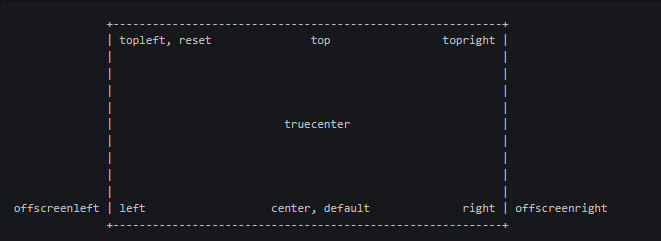

**Dato curioso:** `center` y `default` hacen esencialmente lo mismo: colocan el elemento en el centro horizontal de la pantalla. `reset`, por su parte, devuelve las propiedades de transformación a sus valores predeterminados.

---
#### Cláusula AT

La cláusula **`at`** se utiliza para aplicar una **transformación** a una imagen cuando la muestras en pantalla.

La estructura básica es:

```python
show + imagen + at + nombre_de_la_transformacion
```

Por ejemplo:

```python
show eileen happy at right (o cualquier transformación por defecto).
```

Aquí:

- `show` → indica que queremos mostrar una imagen.
- `eileen happy` → es la imagen que queremos mostrar.
- `at` → indica que vamos a aplicar una transformación.
- `right` → es la transformación que queremos aplicar.

*Puedes crear tus propias posiciones de imagen, pero eso es más avanzado, más adelante lo veremos.*

---
#### Posiciones por defecto

| Posición                 | Descripción                                                                                                                             |
| ------------------------ | --------------------------------------------------------------------------------------------------------------------------------------- |
| **`center` / `default`** | Centra horizontalmente y alinea el elemento con la parte inferior de la pantalla.                                                       |
| **`left`**               | Alinea el elemento con la esquina inferior izquierda de la pantalla.                                                                    |
| **`offscreenleft`**      | Coloca el elemento fuera del lado izquierdo de la pantalla, alineándolo con la parte inferior de esta.                                  |
| **`offscreenright`**     | Coloca el elemento fuera del lado derecho de la pantalla, alineándolo con la parte inferior de esta.                                    |
| **`reset`**              | Restablece la transformación a los valores predeterminados de cada propiedad, eliminando cualquier propiedad establecida anteriormente. |
| **`right`**              | Alinea el elemento con la esquina inferior derecha de la pantalla.                                                                      |
| **`top`**                | Centra horizontalmente y alinea el elemento con la parte superior de la pantalla.                                                       |
| **`topleft`**            | Alinea el elemento con la esquina superior izquierda de la pantalla.                                                                    |
| **`topright`**           | Alinea el elemento con la esquina superior derecha de la pantalla.                                                                      |
| **`truecenter`**         | Centra el elemento tanto horizontal como verticalmente.                                                                                 |

> **Aclaración:**
> 
> Puedes crear tus propias transformaciones, por ende, tener más control sobre elementos en la pantalla. Eso es más avanzado y lo veremos más adelante.

---
#### Transiciones por defecto

| Transición          | Descripción                                                                                                                                     |
| ------------------- | ----------------------------------------------------------------------------------------------------------------------------------------------- |
| **`dissolve`**      | Cambia suavemente de una escena a otra mediante un efecto de disolución. Dura **0,5 segundos**.                                                 |
| **`fade`**          | Hace que la pantalla se desvanezca a negro y luego muestre gradualmente la nueva escena.                                                        |
| **`pixellate`**     | Cambia de una escena a otra mediante un efecto de pixelado.                                                                                     |
| **`move`**          | Mueve suavemente las imágenes desde su posición actual hasta una nueva posición.                                                                |
| **`moveinright`**   | Hace que una imagen entre en la pantalla desde la derecha. También existen `moveinleft`, `moveintop` y `moveinbottom`.                          |
| **`moveoutright`**  | Hace que una imagen salga de la pantalla hacia la derecha. También existen `moveoutleft`, `moveouttop` y `moveoutbottom`.                       |
| **`ease`**          | Funciona de manera similar a `move`, pero el movimiento comienza y termina de forma más suave. También existen variantes para cada dirección.   |
| **`zoomin`**        | Hace que una imagen aparezca mediante un efecto de acercamiento o **zoom**.                                                                     |
| **`zoomout`**       | Hace que una imagen desaparezca mediante un efecto de alejamiento.                                                                              |
| **`zoominout`**     | Combina ambos efectos: acerca la imagen que entra y aleja la imagen que sale.                                                                   |
| **`vpunch`**        | Sacude rápidamente la pantalla de forma **vertical**.                                                                                           |
| **`hpunch`**        | Sacude rápidamente la pantalla de forma **horizontal**.                                                                                         |
| **`blinds`**        | Cambia de escena mediante un efecto similar al de unas **persianas verticales**.                                                                |
| **`squares`**       | Cambia de escena utilizando un efecto formado por **cuadrados**.                                                                                |
| **`wipeleft`**      | Revela la nueva escena mediante un efecto de barrido hacia la izquierda. También existen `wiperight`, `wipeup` y `wipedown`.                    |
| **`slideleft`**     | Desliza la nueva escena hacia la pantalla desde la izquierda. También existen `slideright`, `slideup` y `slidedown`.                            |
| **`slideawayleft`** | Desliza la escena actual fuera de la pantalla hacia la izquierda. También existen `slideawayright`, `slideawayup` y `slideawaydown`.            |
| **`pushright`**     | La nueva escena entra desde la derecha, empujando a la escena anterior fuera de la pantalla. También existen `pushleft`, `pushup` y `pushdown`. |
| **`irisin`**        | Muestra la nueva escena mediante una abertura rectangular que se expande. También existe `irisout`, que realiza el efecto contrario.            |

> **Aclaración:**
> 
> Tambien puedes crear tus propias animaciones. Pero eso lo veremos cuando sea necesario :D.


---
### Labels y flujo de control

#### label `start`

Los labels (marcas en español) permiten identificar puntos específicos de una novela visual, facilitando el control del flujo, la organización de las escenas y la creación de diferentes rutas narrativas.

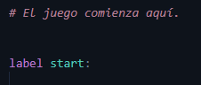

En `script.rpy` encontrarás por defecto el label `start`. Ren'Py utiliza este label como punto de inicio del juego, por lo que la ejecución comienza allí al iniciar la novela visual.

`start` es el label que Ren'Py utiliza **por defecto como punto de inicio**, pero no es que sea técnicamente imposible cambiarlo. Ren'Py permite configurar otro punto de inicio mediante `config.start`.

*Pero eso es un poquito más avanzado y realmente no es necesario para empezar.*

> **Advertencia:** La indentación es muy importante en Ren'Py. Los elementos que pertenecen a un `label` deben estar correctamente indentados. Una indentación incorrecta puede provocar errores.

---

**¿Qué es la indentación?**

La **indentación** es el espacio que se coloca al comienzo de una línea de código para indicar que esa línea pertenece a un bloque de código.

En Ren'Py, puedes imaginarla como una forma de **organizar el código por niveles**:

```python
label start:
    "Esta línea pertenece al label."
"Esta no." # -> Y además te dara error.
```

 **Una forma fácil de recordarlo:** la indentación funciona como una sangría en un documento. Cuanto más hacia la derecha está una línea, más profundamente pertenece al bloque anterior.

> **Advertencia:** Si quieres que el nombre de un `label` tenga varias palabras, debes separarlas utilizando un guion bajo `_`. **No utilices espacios.**

Por ejemplo, si quieres crear un label llamado **inicio de la historia**, no puedes escribirlo así:

```python
label inicio de la historia: # -> Te dará error.
```

En su lugar, debes utilizar `_` para unir las palabras:

```python
label inicio_de_la_historia: # Usamos "_" para alargar el nombre, esta es la forma correcta, aunque también puedes hacerlo asi:

label inicioDeLaHistoria: # A mí no me gusta, pero es otra forma de hacerlo.

```

El guion bajo `_` permite que Ren'Py entienda todo el nombre como **un solo identificador**.

Puedes utilizarlo tantas veces como necesites:

```python
label escena_yuri:
```

```python
label primera_escena_yuri:
```

```python
label final_bueno_yuri:
```

**Recuerda:** cuando quieras separar palabras dentro del nombre de un `label`, utiliza `_` en lugar de espacios.

---
#### Sentencia `jump`

La sentencia `jump` permite **mover el flujo de la novela visual desde el punto actual hasta otro `label`**.

Puedes imaginarlo como un **salto directo**: Ren'Py deja de ejecutar lo que viene después y continúa desde el `label` que hayas indicado.

La forma básica es:

```python
jump nombre_del_label
```

Por ejemplo:

```python
label inicio:
    "La historia comienza."
    jump escena_yuri

label escena_yuri:
    "Yuri entra en la habitación."
```

Cuando Ren'Py llega a:

```python
jump escena_yuri
```

salta directamente hasta:

```python
label escena_yuri:
```

Por lo tanto, **no continuará con las líneas que estuvieran después del `jump` dentro de `inicio`**.

---

**Las rutas de una novela visual**

`jump` es especialmente útil para crear diferentes caminos en una novela visual.

Por ejemplo:

```python
label inicio:
    "¿Qué quieres hacer?"

    menu: # Ya hablaremos de menu
        "Hablar con Yuri":
            jump ruta_yuri

        "Ir a casa":
            jump ruta_casa


label ruta_yuri:
    "Decidiste hablar con Yuri."
    "Ella sonríe."

label ruta_casa:
    "Decidiste regresar a casa."
```

El jugador puede tomar una decisión y `jump` llevará la historia al `label` correspondiente.

La estructura sería:

```
                 inicio
                /      \
               /        \
          ruta_yuri   ruta_casa
```

Esto permite organizar fácilmente **rutas, escenas, finales y diferentes partes de la historia**.

---

#### Sentencia `menu`

La sentencia `menu` permite **mostrar diferentes opciones al jugador para que pueda tomar una decisión**.

En una novela visual, los `menu` son una de las principales formas en las que el jugador puede **influir en el desarrollo de la historia**.

Por ejemplo:

```python
menu:
    "Hablar con Yuri": # Agrega dos puntos para señalar que es una opción.
        "Decidiste hablar con Yuri."

    "Ir a casa":
        "Decidiste regresar a casa."
```

El jugador verá dos opciones:

```
¿Qué quieres hacer?

→ Hablar con Yuri
→ Ir a casa
```

Dependiendo de la opción que elija, Ren'Py ejecutará las instrucciones correspondientes.

> **Ejemplo:**

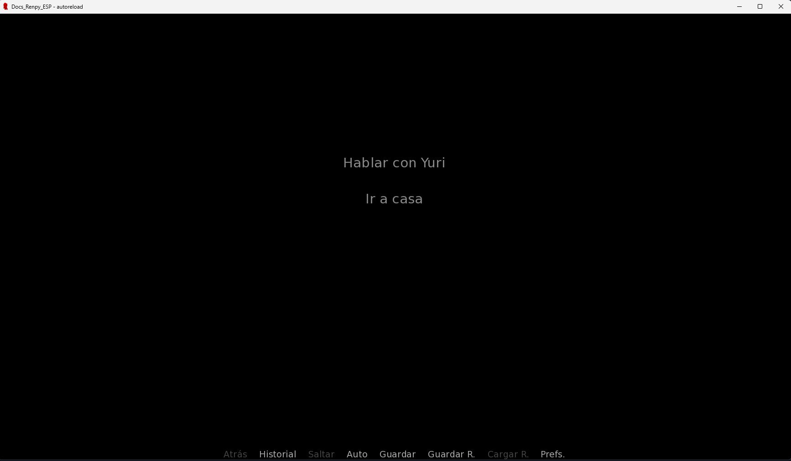


---

#### La estructura de un `menu`

Un `menu` funciona mediante **bloques indentados**.

*No te olvides de la indentación.*

```python
menu:
    "Primera opción":
        "Esto ocurre si eliges la primera opción."

    "Segunda opción":
        "Esto ocurre si eliges la segunda opción."
```

Podemos dividirlo así:

```python 
menu:
    ↓
    Opciones disponibles
        ↓
        Lo que ocurre al elegir cada opción
```

La indentación vuelve a ser muy importante.

> **Advertencia:** Cada opción del `menu` debe estar correctamente indentada. Además, las instrucciones que pertenecen a esa opción deben tener un nivel adicional de indentación.

---

#### Usando `menu` con `jump`

Aquí es donde `menu` y `jump` comienzan a trabajar juntos.

Imagina que quieres que el jugador elija entre dos rutas:

```python
label inicio:
    "¿Qué quieres hacer?"

    menu:
        "Hablar con Yuri":
            jump ruta_yuri

        "Ir a casa":
            jump ruta_casa
```

Si el jugador selecciona:

```
Hablar con Yuri
```

Ren'Py ejecutará:

```python
jump ruta_yuri
```

Y continuará en:

```python
label ruta_yuri:
    "Decidiste hablar con Yuri."
```

Mientras que si el jugador selecciona:

```
Ir a casa
```

Ren'Py ejecutará:

```python
jump ruta_casa
```

Y continuará en:

```python
label ruta_casa:
    "Decidiste regresar a casa."
```

El flujo sería:

```
                Inicio
                   ↓
                 menu
                /    \
               ↓      ↓
        Hablar con   Ir a casa
           Yuri
             ↓          ↓
        jump ruta_yuri  jump ruta_casa
             ↓          ↓
         Ruta Yuri    Ruta Casa
```

> **En resumen:** `menu` permite que el jugador tome una decisión, mientras que `jump` puede utilizarse para llevar esa decisión hacia diferentes partes de la historia.

---

 **Un detalle importante**

No siempre necesitas usar `jump` dentro de un `menu`.

También puedes hacer algo simple:

```python
menu:
    "Comer pizza":
        "Decidiste comer pizza."

    "Comer hamburguesa":
        "Decidiste comer una hamburguesa."

"Después de comer, continué con mi día."
```

Cuando termina la opción elegida, Ren'Py puede continuar con el código que está después del `menu`. La documentación oficial describe precisamente que, si una opción termina sin transferir el control a otro lugar, la ejecución continúa después del bloque del menú

---

 **`jump` no regresa al punto anterior**

Una característica importante de `jump` es que **no guarda el lugar desde donde realizaste el salto para volver después**.

Por ejemplo:

```python
label inicio:
    "Antes del salto."

    jump otra_escena

    "Esta línea no se ejecutará."
```

Después del `jump`, Ren'Py continúa desde `otra_escena`.

Si necesitas ir a otra parte de la historia **y después regresar al lugar donde hiciste el salto**, existe otra instrucción llamada `call`, que veremos más adelante.

Puedes pensar en la diferencia así:

- `jump` → **"Ve allí y continúa desde allí."**
- `call` → **"Ve allí, haz lo que tengas que hacer y después regresa."**

*Ya hablaremos de `call`.*

---

**En resumen:** 

**`jump` permite cambiar directamente el punto de ejecución de la novela visual. Al utilizarlo, Ren'Py continúa la historia desde el `label` indicado y no regresa automáticamente al lugar desde donde se realizó el salto.**

**Dato curioso:** `jump` puede utilizarse para crear un bucle. Si un label hace `jump` hacia sí mismo, Ren'Py volverá a ejecutar ese mismo bloque una y otra vez:

```python
label bucle:
    "¡Estamos atrapados!"

    jump bucle
```

---

#### Labels globales y locales

Ren'Py tiene dos tipos de labels: **globales y locales**.

> **Recordatorio:**`jump` también puede utilizar labels locales
#### Label global

Un label global puede utilizarse desde cualquier parte del proyecto y debe tener un nombre único.

```python
label historia_yuri:
    "La historia comienza."
```

---
#### Label local

Un label local pertenece a un label global. Se escribe colocando un `.` antes de su nombre:

```python
label historia_yuri:
    "Comienza la historia."
    jump .escena_1

label .escena_1:
    "Yuri entra en la habitación."
    jump .escena_2

label .escena_2:
    "Yuri se sienta."
```

En este ejemplo, `.escena_1` y `.escena_2` pertenecen a `historia_yuri`.

Los labels locales son útiles para **organizar mejor las diferentes partes de una historia**. Además, distintos labels globales pueden tener labels locales con el mismo nombre:

```python
label historia_yuri:
	jump .escena
	
label .escena:
    "Escena de Yuri."

label historia_sayori:
    jump .escena
        
label .escena:
	"Escena de Sayori."
```

No hay conflicto porque cada `.escena` pertenece a un label global diferente.

> **En resumen:** los labels globales sirven como puntos principales de la historia, mientras que los labels locales permiten organizar partes más pequeñas dentro de ellos.

---
#### Sentencia `call`  

La sentencia `call` permite **ir temporalmente a otro `label` y regresar automáticamente al punto donde se hizo el `call`**.

Puedes imaginarlo como hacer una visita:

> **`call` = "Ve allí, ejecuta lo que hay y después vuelve aquí."**

Su forma básica es:

```python
call nombre_del_label
```

Por ejemplo:

```python
label inicio:
    "Comienza la historia."

    call escena_yuri

    "La escena de Yuri terminó."

label escena_yuri:
    "Yuri entra en la habitación."

    return # -> Ya hablaremos de return (Es muy fácil.)
```


Ren'Py ejecuta:

```python
call escena_yuri
```

Entonces:

1. Va a `escena_yuri`.
2. Ejecuta sus instrucciones.
3. Llega a `return`.
4. **Regresa a la línea que estaba después de `call`.**
5. Continúa con `"La escena de Yuri terminó."`

La clave está en `return`:

```python
return
```

`return` significa **"terminé lo que vine a hacer, vuelve al lugar desde donde me llamaron"**.

> `call` también puede tener labels locales

```python
label ruta_yuri:
	call .escena
	
label .escena:
	# Escena en ruta yuri
	return

```

---
#### Diferencia entre `jump` y `call`

Esta es una diferencia fundamental:

---

 **`jump`**

---

```python
jump escena_yuri
```

**Salta y continúa allí. No regresa.**

```
Inicio
  ↓
jump
  ↓
Escena Yuri
  ↓
Continúa desde aquí
```

---

**`call`**

---

```python
call escena_yuri
```

**Va allí y después regresa.**

```
Inicio
  ↓
call
  ↓
Escena Yuri
  ↓
return
  ↓
Inicio
  ↓
Continúa después del call
```

**Va allí y después regresa.**

---

> **Ejemplo:**

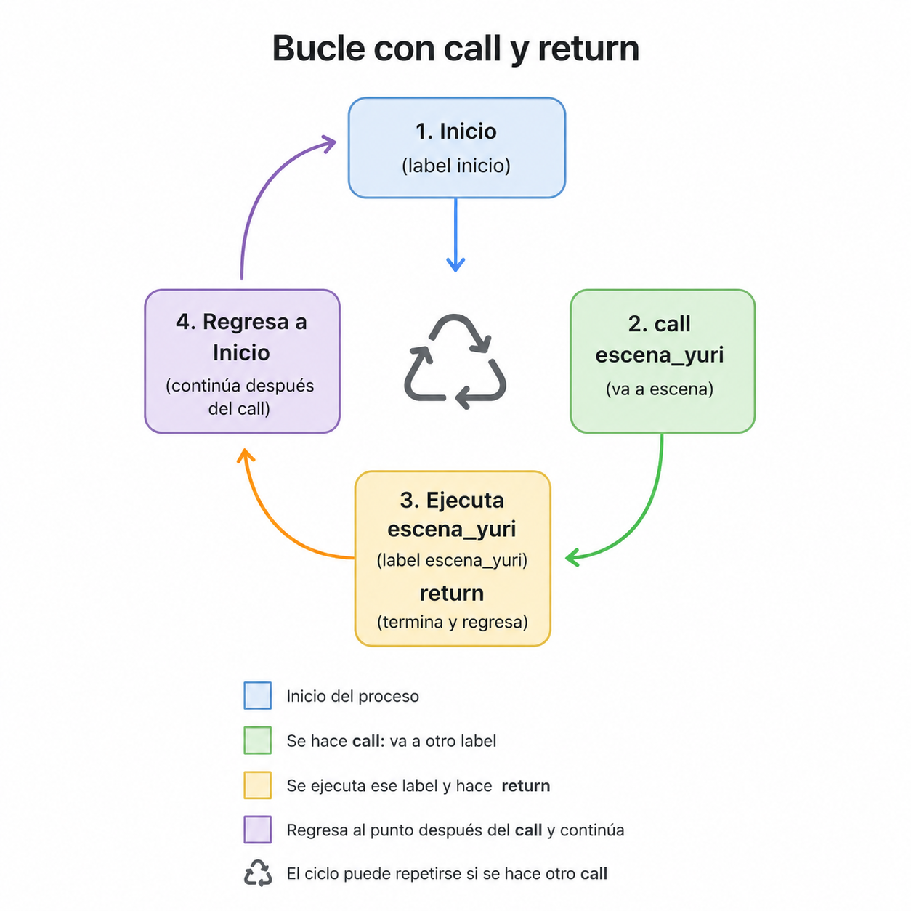

Una forma fácil de recordarlo:

> **`jump` = "Ve allí."**  
> **`call` = "Ve allí y vuelve."**

---

**¿Para qué puede ser útil?**

`call` es especialmente útil cuando tienes una escena o evento que quieres ejecutar **desde diferentes lugares**.

Por ejemplo, puedes crear una pequeña escena de despedida:

```python
label despedida:
    "Yuri se despide de mí."
    "Nos vemos mañana."

    return
```

Y utilizarla desde diferentes partes:

```python
label lunes:
    "Es lunes."

    call despedida
    
label despedida:
	"Después de despedirme, regreso a casa."

label martes:
    "Es martes."

    call despedida
```

La misma escena puede ser reutilizada sin tener que escribirla nuevamente.

---

**`call` y `return` trabajan juntos**

Cuando estás empezando, piensa en estas dos instrucciones como una pareja:

```
call escena
```

> "Ve a `escena`."

Y:

```
return
```

> "Ya terminé. Regresa."

Por ejemplo:

```python
label inicio:
    "Estoy en casa."

    call visitar_yuri

    "Ahora estoy de vuelta en casa."


label visitar_yuri:
    "Voy a visitar a Yuri."
    "Hablamos durante un rato."

    return
```

El resultado sería:

```
Estoy en casa.
      ↓
Voy a visitar a Yuri.
Hablamos durante un rato.
      ↓
Ahora estoy de vuelta en casa.
```

> **Resumen:**
> 
> **`call` permite trasladar temporalmente el flujo de la historia a otro `label`. Cuando ese label ejecuta `return`, Ren'Py regresa al punto donde se realizó el `call` y continúa desde allí.**
> 
> **`jump` y `call` no son lo mismo: `jump` cambia permanentemente el punto de ejecución, mientras que `call` permite ir a otro lugar y regresar.**

---
####  Sentencia `return`

La instrucción `return` se utiliza principalmente para **volver al punto donde se realizó un `call`**.

Por ejemplo:

```python
label inicio:
    "Voy a visitar a Yuri."

    call escena_yuri

    "Ya regresé."


label escena_yuri:
    "Estoy hablando con Yuri."

    return
```

El flujo sería:

```
inicio
   ↓
call escena_yuri
   ↓
escena_yuri
   ↓
return
   ↓
Regresa después del call
```

Cuando Ren'Py encuentra `return`, recuerda dónde se hizo el `call` y continúa la historia desde la siguiente línea.

---

**¿Qué ocurre si `return` no tiene un `call` al que regresar?**

Esta es la parte importante:

> **Si Ren'Py ejecuta `return` y no existe ningún `call` pendiente, Ren'Py reinicia el juego y regresa al menú principal.**

Por ejemplo:

```python
label inicio:
    "La historia ha terminado."

    return
```

Como `inicio` no fue llamado mediante un `call`, no hay ningún lugar al que regresar.

Por lo tanto, Ren'Py vuelve al **menú principal**.

Puedes imaginarlo así:

```
¿Existe un call pendiente?
        │
       ┌┴┐
      Sí No
      │   │
      ↓   ↓
 Regresa  Vuelve al
 después   menú principal
 del call
```

---

 **Una forma sencilla de entenderlo**

Piensa que `call` y `return` funcionan como una pregunta y una respuesta:

```python
call escena_yuri
```

Ren'Py dice:

> **"Voy a esta escena, pero recuerdo dónde estaba para poder regresar."**

Después:

```python
return
```

Ren'Py dice:

> **"Terminé aquí. Regreso al lugar que había guardado."**

Pero si no hay ningún lugar guardado:

```python
return
```

Ren'Py no tiene a dónde regresar dentro de la historia, así que **reinicia Ren'Py y vuelve al menú principal**.

---

 **En resumen:**
 
 **`return` finaliza un `call` y devuelve el control al punto donde fue realizado. Si no existe ningún `call` pendiente, Ren'Py reinicia el juego y regresa al menú principal.**

>**Dato curioso:**
>
 `return` también puede devolver un valor, que Ren'Py guarda en una variable especial llamada `_return`. Esto es útil para que un `label` pueda realizar una acción y enviar un resultado de vuelta al lugar que lo llamó.

---

### Memoria y decisiones

Hasta ahora hemos aprendido cómo crear decisiones y ramificar nuestra novela visual.

Pero existe un problema.

Imagina que el jugador toma una decisión importante al comienzo de la historia:

> **¿Cómo hacemos para que Ren'Py recuerde esa decisión más adelante?**

Por ejemplo, Natsuki podría pedirnos que guardemos un secreto.

```python
menu:

    "¿Guardarás mi secreto?"

    "Sí, puedes confiar en mí.":
        # El jugador acepta guardar el secreto.

    "No puedo prometerte eso.":
        # El jugador no acepta.
```

La decisión ocurre correctamente.

Pero...

**¿Qué pasará dentro de diez escenas?**

¿Cómo sabrá Ren'Py cuál fue la decisión que tomó el jugador?

Aquí es donde entran las **variables**.

Una variable es un espacio donde podemos guardar información que nuestra novela visual necesita recordar.

Podemos utilizarlas para almacenar:

- Decisiones del jugador.
- Puntos de afinidad.
- Nombres.
- Secretos descubiertos.
- Rutas.
- Eventos importantes.
- Estados de los personajes.

En pocas palabras:

> **Las variables son la memoria de nuestra novela visual.**

---

#### Tipos de variables

Una variable puede almacenar diferentes tipos de información.

Por ahora, vamos a trabajar principalmente con estos tipos:

##### Variables numéricas

Guardan números.

```python
default puntos = 10
```

Por ejemplo:

```python
default puntos = 0
```

También podemos comenzar con otro número:

```python
default dinero = 100
```

Las variables numéricas son especialmente útiles para sistemas como:

- Puntos.
- Dinero.
- Afinidad.
- Confianza.
- Estadísticas.
- Contadores.

Por ejemplo, podemos crear un sistema sencillo de afinidad:

```python
default afinidad_natsuki = 0
```

Cada vez que el jugador tome una buena decisión, podemos aumentar ese valor. Más adelante aprenderemos cómo modificarlo.

##### Variables de tipo cadena

Guardan texto.

```python
default nombre = "Gabffee"
```

Las cadenas son útiles para guardar información como:

- Nombres.
- Textos.
- Apodos.
- Respuestas.
- Información escrita.

Por ejemplo, más adelante podríamos permitir que el jugador escriba su nombre y guardarlo en una variable:

```python
default nombre = "Jugador"
```

Después podríamos utilizarlo dentro del diálogo.

##### Variables booleanas

Solo pueden tener dos valores:

```python
True
```

o:

```python
False
```

Por ejemplo:

```python
default conoce_secreto = False
```

También podemos utilizar:

```python
None
```

`None` significa que la variable **todavía no tiene ningún valor asignado**. Esto puede ser especialmente útil cuando queremos representar una situación donde el jugador **todavía no ha tomado una decisión**.

Imaginemos que más adelante el jugador debe decidir si confía en Natsuki:

```python
default confia_en_natsuki = None
```

Al inicio de la historia:

> El jugador todavía no ha decidido.

Más adelante:

```python
$ confia_en_natsuki = True
```

O:

```python
$ confia_en_natsuki = False
```

Ahora podemos distinguir **tres estados diferentes**:

|Valor|Significado|
|---|---|
|`None`|Todavía no existe una decisión|
|`True`|El jugador confía|
|`False`|El jugador no confía|

Esto es importante porque `None` **no significa lo mismo que `False`**.

Por ejemplo:

```python
default acepto_ayuda = None
```

Puede significar:

> El jugador todavía no ha respondido.

Mientras que:

```python
default acepto_ayuda = False
```

Significa:

> El jugador respondió y decidió no aceptar.

**Los booleanos son perfectos para responder preguntas como:**

- ¿El jugador descubrió el secreto?
- ¿Conoció a este personaje?
- ¿Tomó esta decisión?
- ¿Desbloqueó esta escena?
- ¿Aceptó una propuesta?

Por ejemplo:

```python
default ayudo_a_natsuki = False
```

La variable responde a una pregunta:

> **¿El jugador ayudó a Natsuki?**

Al principio: `No.` Por eso su valor es `False`.

Si el jugador la ayuda:

```python
$ ayudo_a_natsuki = True
```

Ahora la respuesta será: `Sí.`

---

#### `default` — darle un valor inicial a la variable

Antes de utilizar una variable, necesitamos darle un valor inicial. En Ren'Py normalmente utilizamos:

```python
default
```

Por ejemplo:

```python
default puntos = 0
```

Esto crea una variable llamada `puntos` y le asigna inicialmente el valor `0`. Podemos interpretarlo así:

> **Al comenzar una nueva partida, la variable `puntos` tendrá el valor `0`.**

Veamos otro ejemplo:

```python
default nombre = "Jugador"
```

Aquí estamos creando una variable llamada `nombre` que inicialmente contiene el texto `"Jugador"`.

La estructura general sería:

```python
default nombre_variable = valor
```

Por ejemplo:

```python
default confianza = 0
default nombre = "Jugador"
default conoce_secreto = False
```

Cada variable guarda información diferente.

---

#### ¿Cómo modifico una variable?

Ya sabemos cómo crear variables con `default`. Pero existe una pregunta importante:

> **¿Cómo cambiamos el valor de una variable durante nuestra historia?**

Por ejemplo:

```python
default afinidad_natsuki = 0
```

Si el jugador toma una buena decisión... **¿cómo hacemos que la afinidad aumente?**

Para modificar variables directamente dentro del guion, podemos utilizar:

```python
$
```

El símbolo `$` nos permite ejecutar una instrucción de Python directamente en nuestro script.

Por ejemplo:

```python
$ afinidad_natsuki = 5
```

Ahora la variable tendrá el valor `5`.

También podemos modificar booleanos:

```python
$ conoce_secreto = True
```

O cadenas:

```python
$ nombre = "Gabffee"
```

A partir de aquí podemos aprender algo todavía más útil:

> **¿Cómo aumentamos, disminuimos o modificamos variables sin tener que escribir manualmente todo su valor?**

Eso nos lleva a operaciones como:

```python
$ puntos += 1
```

y:

```python
$ puntos -= 1
```

---

#### Comparadores — cómo preguntarle algo a una variable

Ahora sabemos que las variables pueden guardar y modificar información. Pero...

**¿Cómo podemos comprobar esa información?**

Por ejemplo:

```python
default afinidad_natsuki = 5
```

¿Cómo podemos preguntarle a Ren'Py si la afinidad es mayor que `3`?

Para hacer esto utilizamos **operadores de comparación**. Los comparadores nos permiten comparar valores y obtener un resultado: `True` o `False`.

Por ejemplo:

```python
afinidad_natsuki >= 5
```

Ren'Py comprobará si el valor de `afinidad_natsuki` es mayor o igual a `5`. Si tenemos `default afinidad_natsuki = 5`, el resultado será `True`.

##### Igual a `==`

Para comprobar si dos valores son iguales utilizamos `==`.

```python
afinidad_natsuki == 5
```

Esto pregunta: **¿La afinidad con Natsuki es exactamente igual a `5`?**

##### Diferente de `!=`

```python
afinidad_natsuki != 5
```

Esto pregunta: **¿La afinidad con Natsuki es diferente de `5`?**

##### Mayor que `>`

```python
afinidad_natsuki > 5
```

Esto significa: **¿La afinidad con Natsuki es mayor que `5`?**

##### Menor que `<`

```python
afinidad_natsuki < 5
```

Esto significa: **¿La afinidad con Natsuki es menor que `5`?**

##### Mayor o igual que `>=`

```python
afinidad_natsuki >= 5
```

Esto será verdadero si la afinidad es `5, 6, 7, 8, 9, 10...`

##### Menor o igual que `<=`

```python
afinidad_natsuki <= 5
```

Esto será verdadero si la afinidad es `5, 4, 3, 2, 1, 0...`

##### Resumen

|Comparador|Significado|
|---|---|
|`==`|Igual a|
|`!=`|Diferente de|
|`>`|Mayor que|
|`<`|Menor que|
|`>=`|Mayor o igual que|
|`<=`|Menor o igual que|

Estos operadores serán especialmente importantes cuando utilicemos `if`, porque `if` necesita comprobar si una condición es verdadera o falsa.

Por ejemplo:

```python
if afinidad_natsuki >= 5:

    n "Creo que puedo confiar en ti."
```

Aquí está ocurriendo lo siguiente:

1. Ren'Py obtiene el valor de `afinidad_natsuki`.
2. Lo compara con `5`.
3. El comparador produce `True` o `False`.
4. Si el resultado es `True`, se ejecuta el código dentro de `if`.

##### ⚠️ `=` y `==` No son lo mismo

Esta parte **sí merece una pequeña advertencia**, porque los principiantes suelen confundirlos:

```python
=
```

Se utiliza para **asignar un valor**.

```python
$ afinidad_natsuki = 5
```

Mientras que:

```python
==
```

Se utiliza para **comparar dos valores**.

```python
if afinidad_natsuki == 5:
```

> **Resumen:**
> 
> **`=` cambia o asigna un valor.** **`==` compara dos valores.**

---

#### Operadores lógicos — combinar varias preguntas

Hasta ahora hemos aprendido a comparar valores. Por ejemplo:

```python
afinidad_natsuki >= 5
```

Esta comparación puede producir `True` o `False`. Pero...

**¿Qué ocurre si queremos comprobar más de una condición al mismo tiempo?**

Por ejemplo:

> ¿Natsuki confía en nosotros **y** conoce nuestro secreto?

O quizás:

> ¿Tenemos suficiente afinidad **o** conocemos una información importante?

Para crear este tipo de condiciones utilizamos los **operadores lógicos**. Por ahora aprenderemos tres: `and`, `or`, `not`.

##### `and`

`and` significa **Y**. Cuando utilizamos `and`, **todas las condiciones deben cumplirse**.

```python
if afinidad_natsuki >= 5 and conoce_secreto:
```

Aquí estamos haciendo dos preguntas:

1. ¿La afinidad con Natsuki es mayor o igual a `5`?
2. ¿El jugador conoce el secreto?

Como estamos utilizando `and`, **las dos condiciones deben ser verdaderas**.

|Afinidad suficiente|Conoce el secreto|Resultado|
|---|---|---|
|`True`|`True`|`True`|
|`True`|`False`|`False`|
|`False`|`True`|`False`|
|`False`|`False`|`False`|

```python
if afinidad_natsuki >= 5 and conoce_secreto:

    n "Creo que finalmente puedo confiar en ti."
```

Este diálogo solamente aparecerá si la afinidad es mayor o igual a `5` **y además** el jugador conoce el secreto.

> **Con `and`, todo debe cumplirse.**

##### `or`

`or` significa **O**. A diferencia de `and`, con `or` **no es necesario que todas las condiciones sean verdaderas**; solo necesitamos que **al menos una** se cumpla.

```python
if afinidad_natsuki >= 5 or conoce_secreto:
```

|Afinidad suficiente|Conoce el secreto|Resultado|
|---|---|---|
|`True`|`True`|`True`|
|`True`|`False`|`True`|
|`False`|`True`|`True`|
|`False`|`False`|`False`|

```python
if afinidad_natsuki >= 5 or conoce_secreto:

    n "Supongo que podemos hablar sobre esto."
```

> **Con `or`, basta con que una condición se cumpla.**

##### `not`

`not` significa **No**. Se utiliza para negar una condición.

```python
default conoce_secreto = False
```

Podemos preguntar `if conoce_secreto:` (si el jugador conoce el secreto). Pero **¿qué ocurre si queremos comprobar lo contrario?** Usamos `not`:

```python
if not conoce_secreto:

    n "Todavía hay cosas que no sabes sobre mí."
```

Esto significa: **Si el jugador NO conoce el secreto.**

|Valor original|Con `not`|
|---|---|
|`True`|`False`|
|`False`|`True`|

Con `default conoce_secreto = False`, entonces `not conoce_secreto` produce `True`, porque estamos preguntando "¿No conoce el secreto?" y la respuesta es sí.

> **`not` cambia un "sí" por un "no" y un "no" por un "sí".**

##### Combinando operadores lógicos

También podemos combinar varias condiciones para crear cosas como:

```python
menu:

    "¿Qué quieres decirle a Natsuki?"

    "Preguntarle directamente sobre su secreto." if afinidad_natsuki >= 5 and conoce_secreto:
        n "..."
```

Esta opción solamente aparecerá si la afinidad con Natsuki es mayor o igual a `5` **y** el jugador conoce su secreto. Ahora nuestras decisiones pueden depender de varias acciones anteriores, y esto nos permite crear:

- Opciones desbloqueables.
- Conversaciones especiales.
- Rutas alternativas.
- Escenas secretas.
- Diferentes finales.

##### Resumen

|Operador|Significado|Regla sencilla|
|---|---|---|
|`and`|Y|Todo debe cumplirse|
|`or`|O|Al menos una condición debe cumplirse|
|`not`|No|Niega la condición|

Ahora ya sabemos cómo crear condiciones más complejas. Presta atención a `if`, `elif` y `else`.

---

#### `if`, `elif` y `else` — usar la información para tomar decisiones

Ahora que Ren'Py puede recordar información... **¿cómo utilizamos esa información?**

##### `if`

`if` significa: **Si esta condición se cumple, ejecuta este código.**

```python
default conoce_secreto = True

if conoce_secreto:

    n "Ahora sabes demasiado sobre mí."
```

Este diálogo solamente aparecerá si `conoce_secreto = True`. También podemos comprobar valores numéricos:

```python
if afinidad_natsuki >= 5:

    n "Creo que puedo confiar en ti."
```

Esto significa: si la afinidad con Natsuki es mayor o igual a `5`, muestra este diálogo.

##### `elif`

Pero... **¿qué ocurre si tenemos más de dos posibilidades?** Para eso usamos `elif`, que significa algo parecido a: **Si la condición anterior no se cumplió, comprueba esta otra condición.**

```python
if afinidad_natsuki >= 10:

    n "Eres una persona muy importante para mí."

elif afinidad_natsuki >= 5:

    n "Creo que estamos empezando a llevarnos mejor."
```

Ren'Py comprobará las condiciones en orden: primero `afinidad_natsuki >= 10`; si no se cumple, comprobará `afinidad_natsuki >= 5`.

##### `else`

Finalmente tenemos `else`, que significa: **Si ninguna de las condiciones anteriores se cumple, ejecuta esto.**

```python
if afinidad_natsuki >= 10:

    n "Eres una persona muy importante para mí."

elif afinidad_natsuki >= 5:

    n "Creo que estamos empezando a llevarnos mejor."

else:

    n "Todavía no te conozco lo suficiente."
```

Ahora tenemos tres posibles resultados:

|Afinidad|Resultado|
|---|---|
|`10` o más|Gran confianza|
|Entre `5` y `9`|Relación mejorando|
|Menos de `5`|Todavía existe distancia|

---

#### Menús condicionales

Hasta ahora hemos utilizado condiciones para cambiar diálogos. Pero también podemos utilizarlas para cambiar las **opciones disponibles para el jugador**.

```python
menu:

    "¿Qué quieres decirle a Natsuki?"

    "Preguntarle cómo está.":
        n "Estoy bien..."

    "Preguntarle sobre su secreto." if conoce_secreto:
        n "¡¿Por qué estás hablando de eso?!"
```

Observa esta parte: `if conoce_secreto`. La opción "Preguntarle sobre su secreto." solamente aparecerá si el jugador conoce el secreto. Si `conoce_secreto = False`, la opción ni siquiera aparecerá.

Esto permite crear decisiones que dependen de acciones anteriores, como:

- Opciones desbloqueables.
- Nuevas conversaciones.
- Rutas secretas.
- Decisiones especiales.
- Finales alternativos.

---

> **Dato curioso:**
> 
> Ren'Py está construido sobre Python, por eso muchas de las expresiones utilizadas para trabajar con variables —como `if`, `elif`, `else`, `True`, `False` y los operadores `+=`— siguen la sintaxis de Python. Esto permite que Ren'Py combine narrativa con lógica de programación de una forma bastante natural.
