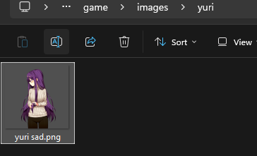

[Descarga Ren'py](https://www.renpy.org/latest.html)
## Crear un proyecto en Ren'Py

Al abrir el _Launcher_ de Ren'Py podrás **cambiar el idioma a español**, crear un proyecto nuevo y elegir su nombre y resolución.

Lo más importante es que la resolución del proyecto coincida con la de las imágenes que utilizarás. De esta forma evitarás tener que escalarlas constantemente y conservarás una mejor calidad visual.


---
## Configurar las preferencias

En **Preferencias** puedes elegir la carpeta donde se guardarán todos tus proyectos.

Te recomiendo mantener una estructura de carpetas ordenada desde el principio. Aunque al inicio parezca un detalle sin importancia, con el tiempo agradecerás saber exactamente dónde está cada proyecto.

Además, te recomiendo instalar **Visual Studio Code** y configurarlo como editor de texto del sistema. Así Ren'Py lo utilizará automáticamente para abrir los archivos `.rpy` y no tendrás que volver a configurarlo después de cada actualización.

[Visual Studio Code - Descargar](https://code.visualstudio.com/download?_exp_download=fb315fc982)


---
## Conociendo la estructura del proyecto

Una vez creado el proyecto (en este ejemplo llamado **NuevoProyecto**), observarás que en la sección **Editar archivo** aparecen varios archivos con la extensión `.rpy`. Estos contienen el código de tu novela visual.

Por ahora no nos centraremos en ellos. Lo importante es la sección **Abrir carpeta**, donde encontrarás la estructura del proyecto y las carpetas en las que agregarás los recursos que utilizará tu juego.


---
## Organizando los recursos

Antes de comenzar a programar la historia, lo habitual es importar todos los recursos del proyecto. Desde el principio intenta mantener una estructura organizada.

También te recomiendo aprender a utilizar **Git** y **GitHub**. No les tengas miedo: son herramientas indispensables para cualquier desarrollador y te ayudarán a mantener un historial de cambios, realizar copias de seguridad y colaborar con otras personas.

En la carpeta `images`, por ejemplo, puedes separar los recursos de la siguiente manera:

- `backgrounds` para los fondos.
    
- `cgs` para las ilustraciones especiales.
    
- `sprites` para los personajes.
    

Dentro de `sprites`, lo ideal es crear una carpeta para cada personaje y guardar allí todas sus expresiones y poses.

Puede parecer una organización excesiva al principio, pero cuando el proyecto crezca te ahorrarás mucho tiempo buscando archivos. Un proyecto ordenado también transmite profesionalidad y facilita el mantenimiento.


Con la carpeta `audio` ocurre lo mismo. Lo recomendable es separar la música de los efectos de sonido en carpetas independientes.

Por ejemplo:

- `music`
    
- `sfx`
    

Esta pequeña organización hará que encontrar un recurso específico sea mucho más rápido a medida que tu proyecto aumente de tamaño.


¡Una vez terminado de organizar tus recursos ya podemos empezar a programar!

---
## Programar en Ren'py

**A partir de aquí aprenderás todo lo necesario para empezar a programar tu novela visual. Es sencillo, ¡no te desanimes!**


A continuación abriremos el archivo **`script.rpy`**.

Por ahora **nos centraremos únicamente en este archivo**, ya que contiene todo lo necesario para comenzar a desarrollar una novela visual desde cero. Más adelante profundizaremos en cada una de las opciones y en las características más avanzadas de Ren'Py.

Al abrir **`script.rpy`**, encontrarás un contenido similar al siguiente:


---
### Líneas de diálogo

#### El narrador

Cuando escribes un texto entre comillas **sin poner un personaje antes**, Ren’Py entiende que el narrador está hablando.

```
label start:

    "La habitación estaba completamente vacía."

    "El viento golpeaba las ventanas."

    return
```

#### Un personaje

Primero debes crear el personaje.

```
define y = Character("Yuri")
```

Después puedes usar la variable `y` para hacer que hable.

```
label start:

    y "Hola."

    y "Me alegra verte."

    return
```

Resultado:

**Yuri**

> Hola.  
> Me alegra verte.

---
### Definir personajes

Como puedes observar en **`script.rpy`**, estamos utilizando la función **`Character()`**, la cual se asigna a la variable **`e`**, correspondiente a **Eileen**. Esta función recibe como parámetro una **cadena de texto** (`string`) con el valor **`"Eileen"`**, que será el nombre que aparecerá en la caja de diálogo del juego cada vez que el personaje hable.


```renpy
define e = Character("Eileen")
```

Puedes ponerle **el nombre que quieras** a una variable, aunque lo recomendable es que sea corto o una abreviatura, ya que esa variable solo la utilizarás **tú** como programador o programadora.

Como dato curioso, la función **`Character()`** te ahorra muchísimo tiempo, ya que evita que tengas que escribir el nombre del personaje cada vez que habla.

Por ejemplo, usando `Character()` escribirías:

```renpy
define y = Character("Yuri")

label start:

    y "Hola."
    y "¿Cómo estás?"
    y "Espero que tengas un buen día."
```

Observa que únicamente escribimos **`y`**, y Ren'Py ya sabe que el nombre que debe mostrar en pantalla es **Yuri**.

Sin embargo, también es completamente válido escribir los diálogos sin definir un personaje:

```renpy
label start:

    "Yuri" "Hola."
    "Yuri" "¿Cómo estás?"
    "Yuri" "Estresado por que tengo que escribir todo el nombre de este pj."
```

Como puedes notar, el nombre **"Yuri"** debe escribirse en cada línea de diálogo. No es un problema cuando el personaje habla una o dos veces, pero si aparece durante toda la historia terminarás escribiendo su nombre cientos de veces.

Por eso, para los personajes principales siempre es recomendable utilizar **`Character()`**.

Si un personaje solo aparecerá una vez o tendrá muy pocas líneas de diálogo, no pasa absolutamente nada por escribir su nombre directamente.

Por ejemplo:

```renpy
label start:

    "Doctor" "Los resultados ya están listos."
```

En este caso crear un personaje con `Character()` sería innecesario.

En cambio, si ese doctor aparecerá varias veces a lo largo de la historia, entonces sí conviene definirlo:

```renpy
define d = Character("Doctor")
```

Y utilizarlo de esta forma:

```renpy
d "Los resultados ya están listos."
d "Necesitamos hacer más estudios."
d "Nos veremos la próxima semana."
```

Como regla general, piensa que **`Character()`** está para hacerte la vida más fácil. Cuanto más aparezca un personaje en tu juego, más sentido tendrá definirlo con esta función.

#### Resumen

```
define e = Character("Eileen")
```

- `e` es el **nombre interno** que tú escribirás en el código.
- `"Eileen"` es el **nombre que verá el jugador** en la caja de diálogo.

Cuando escribes:

```
e "Hola."
```

Ren'Py muestra:

**Eileen:** Hola.

---
### Definiendo imágenes

Ren'py permite estas extensiones **.jpg, .jpeg, .png, .webp, .avif, y .svg**.

#### Sentencia `image`

Para que Ren'Py pueda mostrar una imagen, **primero debes registrarla** mediante la sentencia `image`.

Su sintaxis es la siguiente:

```renpy
image nombre_de_la_imagen = "ruta/del/archivo.png"
```

#### Etiqueta y atributo

El nombre de una imagen en Ren'Py está formado por una **etiqueta** (*tag*) y uno o más **atributos** (*attributes*).

La **etiqueta** identifica al personaje o recurso principal, mientras que los **atributos** describen su estado, expresión, ropa, pose o cualquier otra característica.

Por ejemplo:

```renpy
image yuri casual happy = "images/sprites/yuri/casual_happy.png"
```

En este caso:

- **Etiqueta:** `yuri`
- **Atributos:** `casual` y `happy`

Otro ejemplo:

```renpy
image monika school angry = "images/sprites/monika/school_angry.png"
```

Aquí Ren'Py interpreta:

- **Etiqueta:** `monika`
- **Atributos:** `school` y `angry`

Fíjate que **los espacios son importantes**. Cada palabra forma parte del nombre de la imagen y Ren'Py las interpreta como una etiqueta seguida de uno o más atributos.

#### Registro automático de imágenes

Hay una característica de Ren'Py que muchos desarrolladores principiantes pasan por alto.

Si guardas tus imágenes dentro de la carpeta `game/images`, **Ren'Py las registrará automáticamente**, por lo que no será necesario definirlas manualmente con la sentencia `image`.

Por ejemplo, este archivo:



```
game/images/sprites/eileen/Eileen neutral.png
```

se registrará automáticamente como:

```renpy
image eileen neutral
```

Esto reduce la cantidad de código que debes escribir y hace que tu proyecto sea mucho más fácil de mantener.

**Mi recomendación**:

Utiliza nombres **descriptivos y consistentes** para tus imágenes, audios y variables. Puede parecer un detalle sin importancia cuando el proyecto es pequeño, pero conforme crezca agradecerás poder identificar cada recurso con solo leer su nombre.

Como puedes ver, mi *sprite* está guardado dentro de `game/images/sprites/eileen/`. No he definido la imagen con la sentencia `image`, porque Ren'Py la registrará automáticamente.

Para que esto funcione correctamente, el nombre del archivo debe seguir el formato **etiqueta atributo**, separados por un espacio. En este ejemplo, `Eileen` es la **etiqueta** (*tag*) y `neutral` es el **atributo** (*attribute*).

```renpy
image eileen neutral
```

#### Importante

Ren'Py **no distingue entre mayúsculas y minúsculas** al registrar imágenes. Internamente convierte el nombre a minúsculas.

Por ejemplo, estas definiciones son equivalentes:

```renpy
image Yuri Happy = "images/sprites/yuri/Yuri_Happy.png"
```

```renpy
image yuri happy = "images/sprites/yuri/Yuri_Happy.png"
```

En ambos casos la imagen se muestra de la misma forma:

```renpy
show yuri happy
```

Aun así, te recomiendo escribir siempre las etiquetas y los atributos en minúsculas para mantener un código consistente y fácil de leer.

#### ¿Por qué usar etiquetas y atributos?

La principal ventaja es que Ren'Py puede cambiar automáticamente la imagen de un personaje sin que tengas que ocultarla primero.

Por ejemplo:

```renpy
show yuri happy
```

Más adelante basta con escribir:

```renpy
show yuri sad
```

Como ambas imágenes comparten la etiqueta `yuri`, Ren'Py reemplazará automáticamente la expresión anterior por la nueva.

Gracias a este sistema, normalmente **no es necesario utilizar `hide` para cambiar la expresión, la pose o la ropa de un personaje.**

#### Sentencias `show` y `hide`

Una vez registrada una imagen, puedes mostrarla con la sentencia `show`.

```renpy
show yuri happy
```

Y eliminarla de la pantalla con:

```renpy
hide yuri
```

Generalmente `hide` se utiliza cuando realmente quieres que un personaje desaparezca de la escena, por ejemplo:

- Cuando un personaje abandona la escena.
- Antes de mostrar un CG.
- Al cambiar de escenario.
- Cuando un elemento ya no debe permanecer visible.
#### ¿Y si no quiero usar la sentencia `image`?

También es completamente válido mostrar un archivo indicando su ruta directamente.

```
show "images/sprites/yuri/happy.png"
```

En este caso Ren'Py cargará esa imagen sin necesidad de haberla registrado antes.

Muchos desarrolladores utilizan este método para imágenes que solo aparecerán una vez, pruebas rápidas o recursos temporales.

Sin embargo, para personajes que cambiarán constantemente de expresión, la sentencia `image` resulta mucho más cómoda y mantiene el código limpio y organizado.

---
### Audio

Ren’Py permite reproducir música, efectos de sonido y voces durante el juego. Es uno de los sistemas más importantes en una novela visual, ya que la música crea la atmósfera y los efectos de sonido hacen que las escenas se sientan más vivas.

#### Formatos de audio compatibles

Ren’Py soporta los siguientes formatos:

- **Opus**
- **Ogg Vorbis (.ogg)**
- **MP3**
- **MP2**
- **FLAC**
- **WAV** (solo PCM de 16 bits sin comprimir)

Aunque todos funcionan, **mi recomendación es usar `.ogg`**, especialmente para proyectos de Ren’Py y videojuegos.

#### ¿Por qué usar `.ogg`?

Ogg Vorbis ofrece un excelente equilibrio entre **calidad de audio, tamaño del archivo y compatibilidad**.

##### Ventajas

- **Archivos más pequeños** que WAV.
- **Muy buena calidad de sonido**.
- **Carga rápida** dentro del juego.
- **Compatibilidad nativa** con Ren’Py.

Por ejemplo, una canción de fondo de 3 minutos puede ocupar:

| Formato | Tamaño aproximado |
| ------- | ----------------- |
| WAV     | 30–40 MB          |
| MP3     | 4–6 MB            |
| OGG     | 3–5 MB            |

Para una novela visual con muchas canciones y efectos, la diferencia puede ser grande, pero puedes usar `.mp3` si así lo deseas, recuerda que esto es únicamente una recomendación .

#### Nombres en automático (Variables)

De igual manera que con las imágenes si tú tienes:

```
game/audio/opening.ogg
```

Puedes reproducirlo directamente así:

```
play music opening
```

Sin escribir la extensión `.ogg`.

Ren’Py convierte el nombre del archivo a minúsculas y lo registra automáticamente.

*Recuerda que esto solo sirve si el archivo de audio esta en la carpeta `game`.*

#### Definiendo audio

Si por alguna razón no deseas usar el registro de nombres automático con Ren'py puedes definir el audio tal que así:

```
define audio.ladrido = "ruta_de/el_audio/ladrido.mp3"

# Y lo usas así

play sound ladrido

```

**Esto sirve para todos los canalés de audio.** ->
#### Los canales de audio

Ren’Py organiza el sonido mediante **canales**. Cada canal tiene un propósito específico.

#### Canal `music`

Se utiliza para la **música de fondo (BGM)**.

Normalmente reproduce una sola canción y esta se repite automáticamente en bucle.

```
play music "opening.ogg"
```

#### Canal `sound`

Está pensado para **efectos de sonido (SFX)**.

Cuando reproduces un nuevo sonido en este canal, reemplaza al anterior y una vez termina su reproducción se detiene..

```
play sound "door_close.ogg"
```

#### Canal `audio`

Este canal permite reproducir **varios sonidos al mismo tiempo**.

Es útil para ambientes complejos, como lluvia, viento y tráfico simultáneamente.

```
play audio "rain.ogg"
play audio "wind.ogg"
play audio "traffic.ogg"
```

Los tres sonidos se reproducirán de forma simultánea. ¡Puedes armar tus playlist de novela visual! _Eso si no admite poner en cola el sonido ni detener la reproducción y por su puesto tampoco se repite en bucle._

#### Canal `voice`

Está diseñado para **voces de los personajes**.

Ren’Py puede reproducir y detener automáticamente las voces cuando los personajes hablan.

```
voice "sayori_001.ogg"

s "¡Buenos días!"
```

Además, el volumen del canal de voz puede controlarse desde las preferencias del juego.

#### Dónde colocar los archivos

Lo más recomendable es guardar todo el audio dentro de la carpeta `game`:

```
game/audio/
```

Una estructura organizada podría verse así:

```
game/
└── audio/
    ├── music/
    │   ├── opening.ogg
    │   └── sad_theme.ogg
    ├── sfx/
    │   ├── door.ogg
    │   └── rain.ogg
    └── voice/
        ├── sayori/
        └── yuri/
```

Luego puedes reproducir los archivos indicando su ruta:

```
play music "music/opening.ogg"
play sound "sfx/door.ogg"
```

#### Sentencia `play`

La instrucción más común es `play`.

```
play music "opening.ogg"
```

Si ya había otra canción reproduciéndose, será reemplazada.

#### Fundidos (fade)

Puedes hacer que la música entre y salga suavemente.

```
play music "opening.ogg" fadein 2.0
```

La música tardará **2 segundos** en alcanzar el volumen normal.

Para cambiar una canción suavemente:

```
play music "sad_theme.ogg" fadeout 1.0 fadein 2.0
```

Esto desvanece la canción anterior durante 1 segundo y la nueva entra durante 2 segundos.

**En resumen fadein es de ingreso y fadeout es de salida.**

#### Reproducir una lista de canciones

Puedes poner varias canciones en secuencia.

```
play music [
    "opening.ogg",
    "theme.ogg",
    "ending.ogg"
]
```

Cuando termine una, comenzará la siguiente.

#### Evitar reiniciar una canción

A veces entras varias veces a una misma pantalla y no quieres que la música vuelva a empezar.

Usa `if_changed`.

```
play music opening if_changed
```

Si `opening` ya está sonando, Ren’Py continuará reproduciéndola sin reiniciarla.

#### Ajustar el volumen de un sonido

Puedes cambiar el volumen de una reproducción específica.

```
play sound "door.ogg" volume 0.5
```

Los valores van de:

- `0.0` = silencio
- `1.0` = volumen normal

Esto es muy útil para sonidos lejanos o ambientales.

#### Sentencia `stop`

Para detener un canal:

```
stop music
```

Con fundido:

```
stop music fadeout 1.5
```

La música desaparecerá gradualmente durante 1.5 segundos.

También funciona con otros canales.

```
stop sound
stop voice
```

#### Una configuración recomendada para principiantes

Para evitar problemas de organización, te recomiendo esta regla:

- **Música:** `.ogg`
- **Efectos de sonido:** `.ogg`
- **Voces:** `.ogg`
- **Archivos originales de edición:** `.wav`

Edita el audio en WAV si necesitas máxima calidad y luego exporta una versión `.ogg` para el juego.

Un dato curioso: **Ogg es el contenedor y Vorbis es el códec de compresión**. Por eso, cuando hablamos de archivos `.ogg`, en realidad normalmente nos referimos a **Ogg Vorbis**, ¡El formato de audio que Ren’Py utiliza con mayor frecuencia en **videojuegos** y n**ovelas visuales**!.

---
### Animaciones y transformaciones con ATL

**¡Atento!... o atenta.**

ATL será realmente útil para tu novela visual, ya que te permitirá posicionar cualquier elemento (sprite o imagen) en prácticamente cualquier lugar de la pantalla.

Por ahora, solo hablaré de las animaciones que el motor tiene por defecto, así como de las diferentes formas de posicionar elementos en pantalla.

*A continuación, puedes ver dónde colocará cada una de estas transformaciones una imagen.*


**Dato curioso:** `center` y `default` hacen esencialmente lo mismo: colocan el elemento en el centro horizontal de la pantalla. `reset`, por su parte, devuelve las propiedades de transformación a sus valores predeterminados.

#### Cláusula AT

La cláusula **`at`** se utiliza para aplicar una **transformación** a una imagen cuando la muestras en pantalla.

La estructura básica es:

```
show + imagen + at + nombre_de_la_transformacion
```

Por ejemplo:

```
show eileen happy at right(o cualquier transformación por defecto.)
```

Aquí:

- `show` → indica que queremos mostrar una imagen.
- `eileen happy` → es la imagen que queremos mostrar.
- `at` → indica que vamos a aplicar una transformación.
- `right` → es la transformación que queremos aplicar.

*Puedes crear tus propias posiciones de imagen, pero eso es más avanzado, más adelante lo veremos.*
#### Posiciones por defecto

| Posición                 | Descripción                                                                                                                             |
| ------------------------ | --------------------------------------------------------------------------------------------------------------------------------------- |
| **`center` / `default`** | Centra horizontalmente y alinea el elemento con la parte inferior de la pantalla.                                                       |
| **`left`**               | Alinea el elemento con la esquina inferior izquierda de la pantalla.                                                                    |
| **`offscreenleft`**      | Coloca el elemento fuera del lado izquierdo de la pantalla, alineándolo con la parte inferior de esta.                                  |
| **`offscreenright`**     | Coloca el elemento fuera del lado derecho de la pantalla, alineándolo con la parte inferior de esta.                                    |
| **`reset`**              | Restablece la transformación a los valores predeterminados de cada propiedad, eliminando cualquier propiedad establecida anteriormente. |
| **`right`**              | Alinea el elemento con la esquina inferior derecha de la pantalla.                                                                      |
| **`top`**                | Centra horizontalmente y alinea el elemento con la parte superior de la pantalla.                                                       |
| **`topleft`**            | Alinea el elemento con la esquina superior izquierda de la pantalla.                                                                    |
| **`topright`**           | Alinea el elemento con la esquina superior derecha de la pantalla.                                                                      |
| **`truecenter`**         | Centra el elemento tanto horizontal como verticalmente.                                                                                 |

#### Transiciones por defecto

|Transición|Descripción|
|---|---|
|**`dissolve`**|Cambia suavemente de una escena a otra mediante un efecto de disolución. Dura **0,5 segundos**.|
|**`fade`**|Hace que la pantalla se desvanezca a negro y luego muestre gradualmente la nueva escena.|
|**`pixellate`**|Cambia de una escena a otra mediante un efecto de pixelado.|
|**`move`**|Mueve suavemente las imágenes desde su posición actual hasta una nueva posición.|
|**`moveinright`**|Hace que una imagen entre en la pantalla desde la derecha. También existen `moveinleft`, `moveintop` y `moveinbottom`.|
|**`moveoutright`**|Hace que una imagen salga de la pantalla hacia la derecha. También existen `moveoutleft`, `moveouttop` y `moveoutbottom`.|
|**`ease`**|Funciona de manera similar a `move`, pero el movimiento comienza y termina de forma más suave. También existen variantes para cada dirección.|
|**`zoomin`**|Hace que una imagen aparezca mediante un efecto de acercamiento o **zoom**.|
|**`zoomout`**|Hace que una imagen desaparezca mediante un efecto de alejamiento.|
|**`zoominout`**|Combina ambos efectos: acerca la imagen que entra y aleja la imagen que sale.|
|**`vpunch`**|Sacude rápidamente la pantalla de forma **vertical**.|
|**`hpunch`**|Sacude rápidamente la pantalla de forma **horizontal**.|
|**`blinds`**|Cambia de escena mediante un efecto similar al de unas **persianas verticales**.|
|**`squares`**|Cambia de escena utilizando un efecto formado por **cuadrados**.|
|**`wipeleft`**|Revela la nueva escena mediante un efecto de barrido hacia la izquierda. También existen `wiperight`, `wipeup` y `wipedown`.|
|**`slideleft`**|Desliza la nueva escena hacia la pantalla desde la izquierda. También existen `slideright`, `slideup` y `slidedown`.|
|**`slideawayleft`**|Desliza la escena actual fuera de la pantalla hacia la izquierda. También existen `slideawayright`, `slideawayup` y `slideawaydown`.|
|**`pushright`**|La nueva escena entra desde la derecha, empujando a la escena anterior fuera de la pantalla. También existen `pushleft`, `pushup` y `pushdown`.|
|**`irisin`**|Muestra la nueva escena mediante una abertura rectangular que se expande. También existe `irisout`, que realiza el efecto contrario.|

*De igual manera, puedes crear tus propias animaciones, pero eso lo veremos más adelante ;D.*

---

